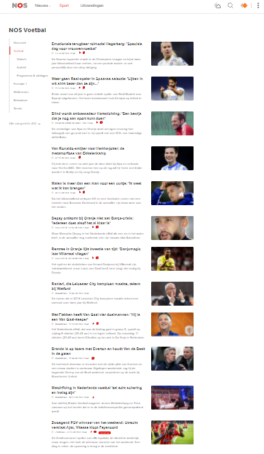
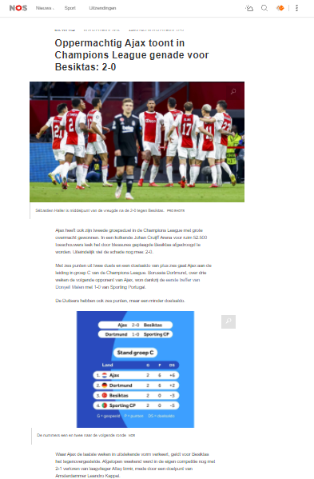

# Procesverslag
Markdown is een simpele manier om HTML te schrijven.  
Markdown cheat cheet: [Hulp bij het schrijven van Markdown](https://github.com/adam-p/markdown-here/wiki/Markdown-Cheatsheet).

Nb. De standaardstructuur en de spartaanse opmaak van de README.md zijn helemaal prima. Het gaat om de inhoud van je procesverslag. Besteedt de tijd voor pracht en praal aan je website.

Nb. Door *open* toe te voegen aan een *details* element kun je deze standaard open zetten. Fijn om dat steeds voor de relevante stuk(ken) te doen.

## Jij

uitwerken voor kick-off werkgroep

### Auteur:
Tejo van der Byrg

#### Je startniveau:
Blauw

#### Je focus:  responsive 
 

## Je website: Nos/sport.nl

uitwerken voor kick-off werkgroep

### Je opdracht:
https://nos.nl/sport/voetbal

#### Screenshot(s) van de eerste pagina (small screen): 
Nos Voetbal 

#### Screenshot(s) van de tweede pagina (small screen):
Oppermachtig Ajax toont in Champions League genade voor Besiktas: 2-0.

 

## Breakdownschets (week 1)

uitwerken na afloop 2e werkgroep

### de hele pagina: 

## Voortgang 1 (week 2)

uitwerken voor 1e voortgang

### Stand van zaken

1.Ervoor zorgen dat de Header altijd zichtbaar is bovenin zonder dat het overlapt met de tekst op de main.

code Header:
    position: fixed;
    display: flex;
    justify-content: space-around;
    background-color: white;
    margin-bottom: 1em;

### Agenda voor meeting
samen met je groepje opstellen

| student 1      | student 2          | student 3    | student 4        |
| ---            | ---                | ---          | ---              |
| dit bespreken  | en dit             | en ik dit    | en dan ik dat    |
| en dat ook nog | dit als er tijd is | nog een punt | dit wil ik zeker |
| ...            | ...                | ...          | ...              |

### Verslag van meeting
hier na afloop snel de uitkomsten van de meeting vastleggen

- Flexblox gebruiken ipv positions.
- z-index in de header gebruiken.
- eerst html afmaken dan beginnen met css.
- de O van NOS in een span zetten en dan rode kleur geven.

## Voortgang 2 (week 3)

uitwerken voor 2e voortgang

### Stand van zaken
IK heb de feedback van week 2 verwerkt, heb extra html/css toegevoegd, Heb een day/light modus aangemaakt en ik heb mijn eerste hamburger menu af.

### Agenda voor meeting
samen met je groepje opstellen

| student 1      | student 2          | student 3    | student 4        |
| ---            | ---                | ---          | ---              |
| dit bespreken  | en dit             | en ik dit    | en dan ik dat    |
| en dat ook nog | dit als er tijd is | nog een punt | dit wil ik zeker |
| ...            | ...                | ...          | ...              |

### Verslag van meeting
hier na afloop snel de uitkomsten van de meeting vastleggen

- Het Hamburger menu laten verschijnen op een andere manier.
- Hamburger menu met mouse over niet met click event.
- Id mainheader weghalen.

## Toegankelijkheidstest (week 4)

uitwerken na test in 8e voortgang

### Bevindingen
Lijst met je bevindingen die in de test naar voren kwamen:

#### Screen reader SVG.
Bij de screenreader merkte ik dat de SVG,s werden voorgelezen als 'afbeelding'. Ik heb geprobeerd dat te fixen met een alt tag maar die mag je niet bij een svg zetten.

#### Darkmode bij oog beperkingen.
Bij de oog beperkingen viel op dat de darkmode makkelijker te lezen was dan light mode. 

#### Toetsenbord. 
Site is met toetsenbord goed bestuurbaar.

#### Met schok is de site moeilijk te besturen. 
Met de schok is de site heel moeilijk te besturen het beste hier tegen zou zijn om voice control te gebruiker maar weet niet hoe ik dat moet doen.

## Voortgang 3 (week 4)

uitwerken voor 3e voortgang

### Stand van zaken
Ik heb deze week een start gemaakt aan de 2de pagina waarin ik ook een video heb ingezet. Daarnaast is de site nu ook toegankelijk.

### Agenda voor meeting
samen met je groepje opstellen

| student 1      | student 2          | student 3    | student 4        |
| ---            | ---                | ---          | ---              |
| dit bespreken  | en dit             | en ik dit    | en dan ik dat    |
| en dat ook nog | dit als er tijd is | nog een punt | dit wil ik zeker |
| ...            | ...                | ...          | ...              |

### Verslag van meeting
hier na afloop snel de uitkomsten van de meeting vastleggen

- Svg alt doormiddel van <titel>
- laad animatie video door poster
- Height:auto; bij de afbeelding in de sections 

## Eindgesprek (week 5)

uitwerken voor eindgesprek

### Stand van zaken
Het laatste gedeelte ging goed en ik ben best tevreden over het eind resultaat met name over het haloween thema.
Op 31 oktober krijgt de site een haloween thema.
Voor de rest ben ik ook tevreden over het laadscherm van de video en de laatste styling.

### Belangrijke dingen
1. Om van de ene pagina naar de andere pagina te navigeren kan beste moeilijk zijn. De index.html is te vinden door in de navigatie op sport te drukken en dan bij het hamburger menu op voetbal te drukken.
De 2de pagina is te vinden door op de index.html pagina te drukken op de bovenste section degene die over Ajax Besiktas gaat.
2. Als ik wat dingen aan de site zou toevoegen zijn het voicecontrol en de video laadscherm zoals bij de echte site.

### Surface plane
Ik heb bij de surface plane de volgende 6 dingen gedaan 
1. Day/light modus. 
2. Dom manipulatie (foto die wisselt bij de day/light modus knop).
3. Video.
4. Animatie (laad animatie video).
5. Custom theme (de site heeft een haloween theme).
6. Advanced positioning (z-index).

## Bronnenlijst

continu bijhouden terwijl je werkt

Nb. Wees specifiek ('css-tricks' als bron is bijv. niet specifiek genoeg).

1. https://stackoverflow.com/questions/4697100/accessibility-recommended-alt-text-convention-for-svg-and-mathml (Gebruikt voor de Titels bij de SVG)
2. https://stackoverflow.com/questions/8230748/how-to-add-loader-image-to-html5-video (gebruikt voor de laad animatie bij de video)
3. https://tecadmin.net/get-current-date-time-javascript/ (gebruikt voor de datum in javascript)

